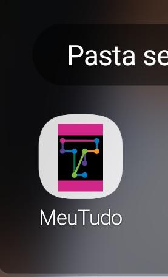
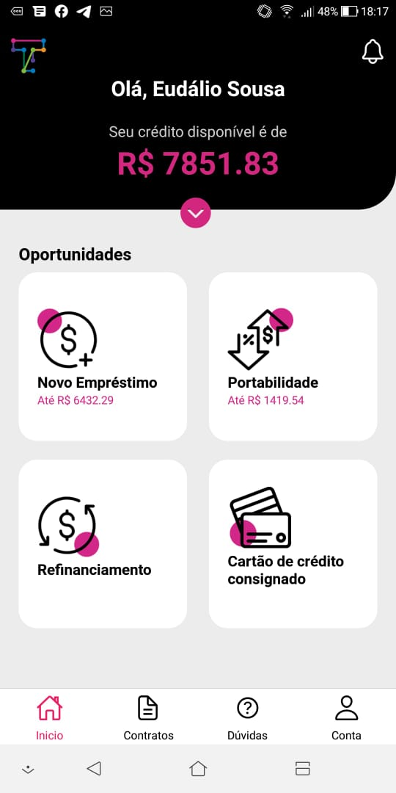
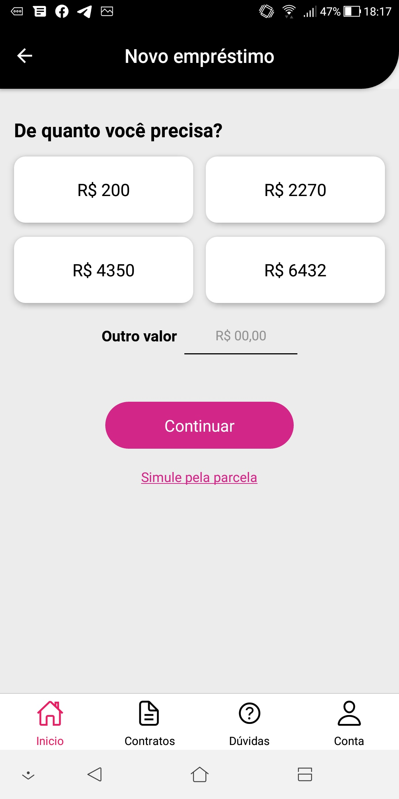
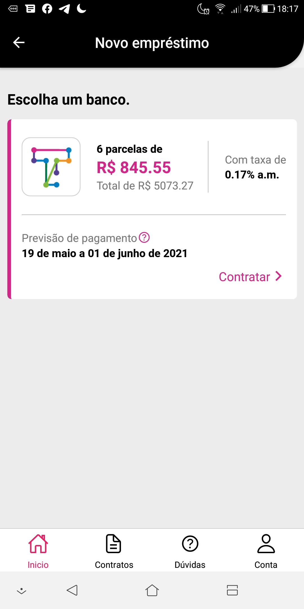

# Observações
Atente-se aos seguintes pontos antes de começar:
### Caso opte por apenas visualizar
- Deixei uma release na raiz do projeto nomeada 'meutudoapp.apk', caso queira apenas ver funcionando sem precisar configurar o ambiente de desenvolvimento
- Basta enviar pro seu celular de maneira como preferir e clicar para instalar, será necessário dar permissão para instalar o aplicativo de fontes desconhecidas
- Necessário ter conexão de internet para uma melhor interação com o aplicativo
### Caso opte por executar o projeto em sua máquina
- Certifique-se de ter o _npm_ e/ou _yarn_ instalado em sua máquina antes de começar

# Instruções para executar projeto
- Faça o clone do projeto em seu computador com o comando: _git clone https://github.com/Eudalio/frontend-challenge.git meutudoapp_
- Dentro da pasta em seu computador execute o comando _npm install_ (ou _npm i_) ou _yarn_, isso vai instalar as dependências listadas no package.json
- Com as dependências instaladas, certifique-se que tem um dispositivo móvel ou emulador instalado na sua máquina e disponível para utilizar. Tendo isso, execute _yarn android_, isso irá executar o build do projeto no seu dispositivo.
- Se tudo ocorer bem, terá o projeto instalado no seu dispositivo.

## Resulado

### Icon

### Home

### Tela 1

### Tela Final
